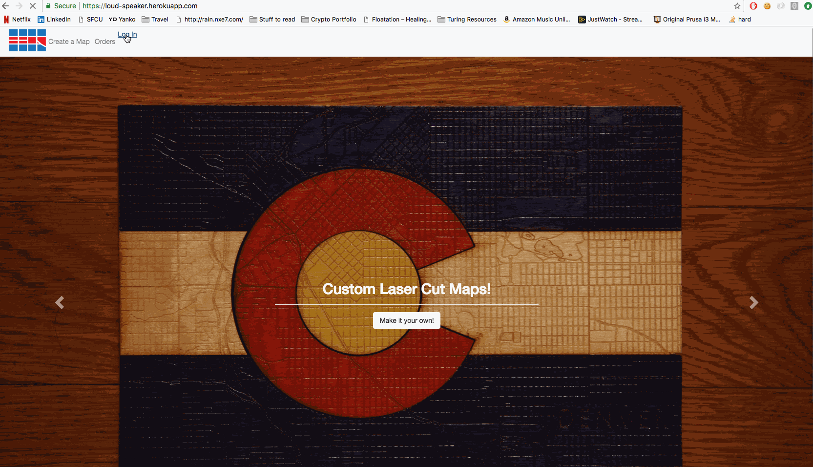
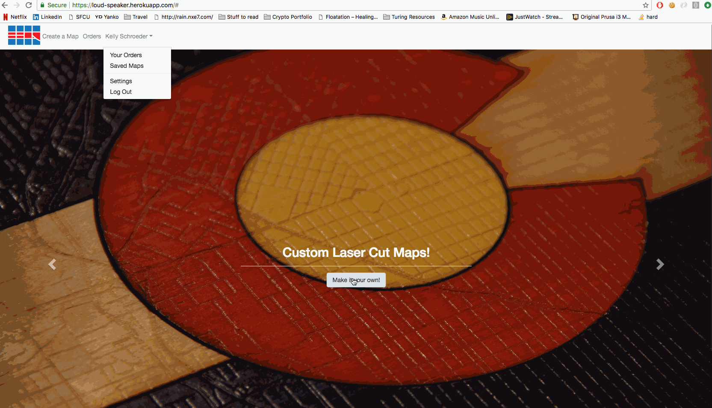
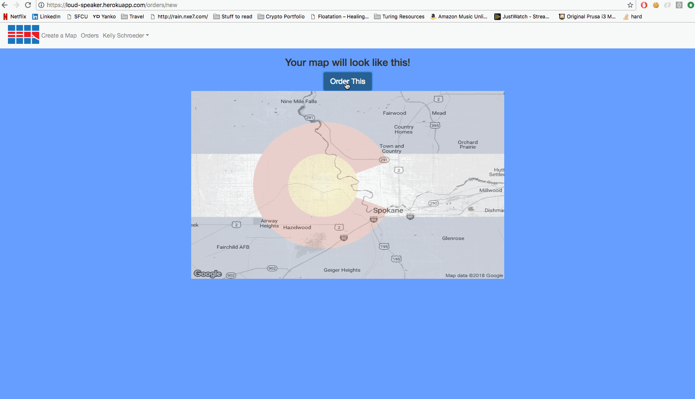
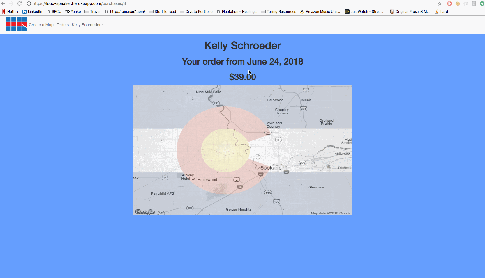

# Loud Speaker

This project is an e-commerce website that will provide consumers with custom designed art and apparel. The original offering will be laser-cut wood maps with state flags laid over top.

Users are able to oauth in via their Google credentials for ease of use.

The main achievement is an interactive map for users to locate the exact position and zoom of a map they would like to have turned into art. The map utilizes both geocoding and geolocation to enhance the user experience.

It then creates and saves a static image of that map to be handled, and offers a preview of the custom map with the flag overlaid.

Once a user decides they would like to purchase the product, they are able to complete a secure purchase using Stripe and taken to a receipt for the transaction.

After a purchase is completed successfully, the user will automatically be sent a confirmation email (using the SendGrid add-on functionality provided by Heroku).

## Main Technologies

* Rails
  - The main framework upon which this app is built
  - Written in Ruby, JS, and HTML
* Heroku
  - Serves as a production environment so that anyone can access the site
* Selenium
  - Allows for testing of JS and AJAX elements in the site
* Stripe
  - Provides a safe, easy way for users to checkout of the store
* Google Maps API
  - Provides interactive map embed
  - Provides Geolocation service to determine a user's location
  - Provides Geocoding service which makes searching by address/name possible
  - Provides connection to static map api in order to produce downloadable images of users' maps
* Google Oauth 2.0
  - Provides a safe, easy way for users to log in without having to share an abundance of personal data
* S3
  - Provides asset hosting for static images, javascript, and CSS
  - Assets automatically sync when deploying to Heroku
* Cloudfront
  - Provides global CDN for static assets and caching
* SendGrid
  - Provides automatic email confirmation after a purchase is completed successfully.

### Peripheral Technologies

* Capybara
* Chromedriver
* Database Cleaner
* FactoryBot
* Faker
* Faraday
* Figaro
* Launchy
* Rspec
* Simplecov
